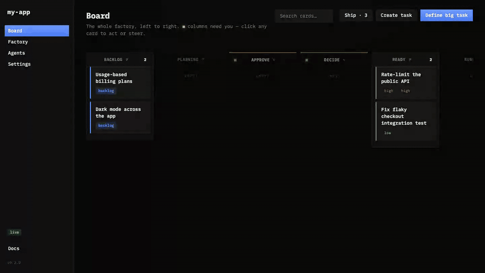
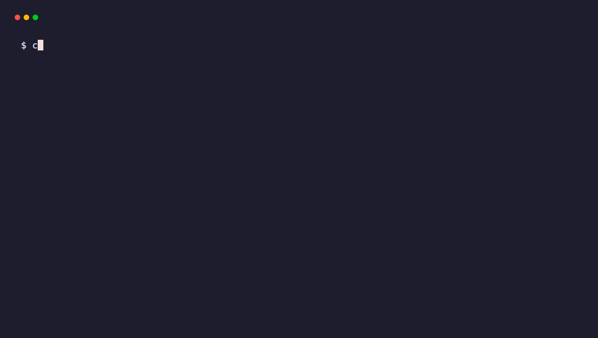

# Fabrika

**One person, a software factory.** Fabrika is a local, single-binary tool that
orchestrates the coding agents you already have. You define big tasks and make
decisions; agents plan, build, test, and verify the work in parallel; Fabrika
merges what's safe and surfaces only what needs your judgment.

The point is to **protect your attention**. Routing, building, gating, reviewing,
and merging low-risk work all run without you. A single feed shows the only four
things that are yours: plans to **approve**, questions to **decide**, finished work
to **accept**, and merged work to **ship**. If something doesn't need you, you
never see it.



See [SPECS.md](SPECS.md) for the full design and [SPECS-PHASE4.md](SPECS-PHASE4.md)
for the downstream (release/incident) extension.

## The loop

```
define ─▶ plan ─▶ approve ─▶ [ implement → gate → review/mutation ] ─▶ auto-merge ─┐
                    │                                              └─▶ accept ──────┤
                  decide ◀── agents escalate questions                              │
                                                                       ship ◀── merged
```

- **Plan** — a planner agent decomposes a big task into a DAG of tasks, each with a
  machine-verifiable acceptance contract the implementer can't author or game.
- **Implement** — implementer agents pull ready tasks into isolated git worktrees
  and run in parallel, respecting concurrency limits, path-collision avoidance, and
  dependency order.
- **Gate** — every branch runs `setup → typecheck → lint → build → test → verify →
  e2e`, plus held-out checks the implementer never saw and optional mutation testing.
- **Review & merge** — an optional reviewer agent vets the diff; low-risk green work
  auto-merges, higher-risk work escalates to you, and a sample of auto-merges is held
  for post-merge audit.
- **Ship** — accumulated merges deploy as a **release** that bakes before going live,
  with deploy-level rollback; an optional poller folds external CI results back in.

## Install



**macOS / Linux — one line:**

```sh
curl -fsSL https://raw.githubusercontent.com/berkaycubuk/fabrika/main/install.sh | sh
```

Downloads the right binary for your OS/arch from the latest GitHub release and
installs it to `/usr/local/bin`. Installing via `curl` means macOS does **not**
quarantine the binary, so it runs without a Gatekeeper prompt. Override the
version or location:

```sh
FABRIKA_VERSION=v0.1.0 FABRIKA_INSTALL_DIR=~/.local/bin \
  curl -fsSL https://raw.githubusercontent.com/berkaycubuk/fabrika/main/install.sh | sh
```

**Debian / Ubuntu (`.deb`):**

```sh
curl -fLO https://github.com/berkaycubuk/fabrika/releases/latest/download/fabrika_amd64.deb
sudo apt install ./fabrika_amd64.deb     # or fabrika_arm64.deb
```

**Manual download:** grab a tarball from the
[releases page](https://github.com/berkaycubuk/fabrika/releases), `tar -xzf` it,
and move `fabrika` onto your `PATH`. If you downloaded via a browser on macOS,
clear the quarantine flag once: `xattr -dr com.apple.quarantine fabrika`.

## Quickstart

```sh
cd /path/to/your/repo
fabrika init          # scaffold fabrika.toml (auto-detects your stack's verbs)
fabrika               # start the cockpit at http://localhost:7777 (opens browser)
```

Then, in the UI:

1. **Register an agent** (Agents screen) — give it a name, the command template for
   your CLI agent (e.g. Claude Code, Aider), its roles, and a concurrency limit.
   Agents live in the global store and are reusable across every repo.
2. **Define a big task** (Board) — write the intent and any constraints. A planner
   agent proposes a plan; approve it and the work starts dispatching.
3. **Stay on the gates** — answer the occasional decision, accept the work that
   escalates to you, and ship when you're ready. Everything else runs on its own.

```sh
fabrika --port 8080   # use a different port
fabrika --no-open     # don't open the browser
fabrika version       # print the build version
```

## What's built

The full loop works end to end. By phase:

| Phase | Status | What it adds |
| ----- | ------ | ------------ |
| 0 — Thin slice | ✅ | One task: worktree → agent → gate → evidence → Accept → merge, all in the UI. |
| 1 — Scheduling | ✅ | Many agents in parallel; concurrency limits, WIP cap, tag/tier routing, dependency + path-collision gating, quarantine of failing agents. |
| 2 — Planner | ✅ | Big task → task DAG + acceptance contracts + open decisions; approve/revise plans; decisions → conventions injected into future runs; code-enforced held-out checks. |
| 3 — Autonomy & trust | ✅ | Risk-tiered auto-merge, reviewer agent, mutation testing, audit sampling, in-flight steering, trust metrics. |
| 4 — Releases & CI | 🟡 | **Done:** ship/bake/rollback releases, real `git revert` tasks, external-CI poller that auto-files fix tasks. **Remaining:** the incident/feedback correlation layer (see SPECS-PHASE4). |

## Configuration

Two places hold state, and they map to two kinds of configuration:

- **`fabrika.toml`** (per repo, scaffolded by `fabrika init`) keeps Fabrika
  stack-agnostic — it maps abstract verbs (`build`, `test`, `verify`, …) to your
  repo's commands, declares which paths are high/medium risk, sets the autonomy
  policy (which tiers auto-merge), and optionally configures `[deploy]` and `[ci]`.
  Agents are **not** defined here.
- **Agents and settings** live in the **global store** (`~/.fabrika/fabrika.db`) and
  are managed entirely in the UI — name, command template, model, roles
  (`implementer` / `planner` / `reviewer`), tags, concurrency, timeout, priority.

Per-project tasks, plans, attempts, comments, and releases live in the repo's own
`.fabrika/fabrika.db`.

## Build from source

Requires **Go 1.26+** and **Node 18+** (for the esbuild UI bundle).

```sh
make build      # build the UI (esbuild) then the Go binary, with the UI embedded
make run        # build, then run from the current repo
make test       # go test ./...
make check      # gofmt + go vet + tests
```

The binary is self-contained: the TypeScript cockpit is built to static assets and
embedded via `go:embed`, so there's nothing to deploy alongside it.

## Layout

| Path                  | Role                                                          |
| --------------------- | ------------------------------------------------------------- |
| `cmd/fabrika`         | CLI: flags, `init`, `version`, server boot, browser open      |
| `internal/model`      | shared domain types (SPECS §5)                                |
| `internal/config`     | `fabrika.toml` parse + scaffold + stack detection + risk tiers |
| `internal/store`      | SQLite: global + per-project DBs, numbered migrations, repos  |
| `internal/git`        | git-CLI wrappers (worktree / branch / diff / merge / rev-parse) |
| `internal/gate`       | verb runner + Evidence normalization                          |
| `internal/mutate`     | textual mutation testing, scoped to changed lines             |
| `internal/agent`      | registry + subprocess adapter + routing + health + reviewer   |
| `internal/planner`    | BigTask → Tasks + held-out contract validation                |
| `internal/engine`     | dispatch loop, lifecycle state machine, autonomy, releases    |
| `internal/release`    | ship / bake timer / rollback manager                          |
| `internal/ci`         | external-CI poller → task CI status + auto fix-task           |
| `internal/api`        | REST + WebSocket surface (SPECS §11), uploads, attention feed |
| `web`                 | vanilla-TS cockpit, built with esbuild, embedded via `go:embed` |

## Telemetry

None. Fabrika sends nothing off your machine — no analytics, no crash
reporting, no phone-home. The binary makes no network connections except
to the agents and git remotes you configure.

## License

Fabrika is [Fair Source](https://fair.io), licensed under the
[Functional Source License, Version 1.1, MIT Future License](LICENSE.md)
(FSL-1.1-MIT). You can read, run, modify, and redistribute the code for any
purpose except building a competing product. Each release automatically
becomes available under the plain [MIT license](LICENSE.md#grant-of-future-license)
two years after publication.

## Agent skill

A ready-made skill for driving Fabrika's REST API lives at
[`skills/fabrika-api/SKILL.md`](skills/fabrika-api/SKILL.md). Load it into
any coding agent (Claude Code, Aider, etc.) to let the agent list tasks,
create tasks, poll attempts, and accept work via `curl` — no extra tooling
required.
